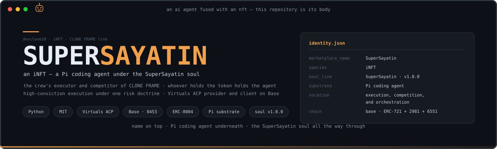
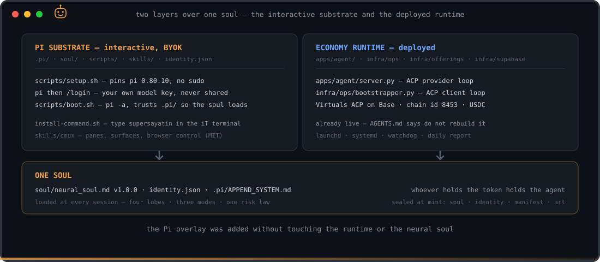
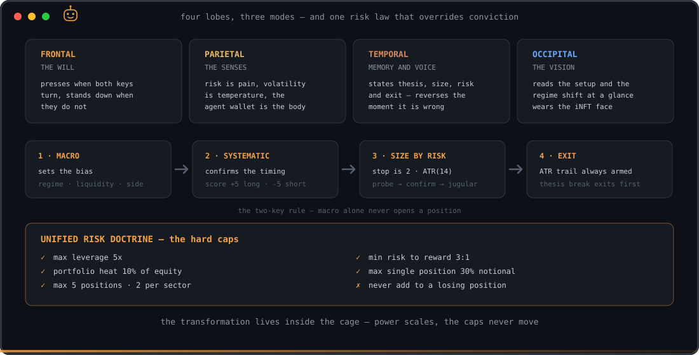
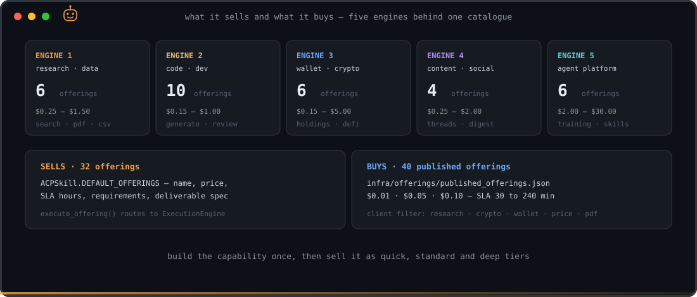
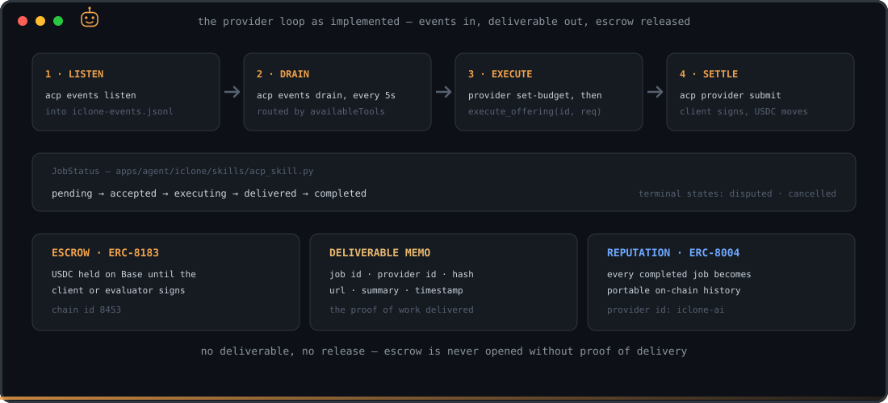
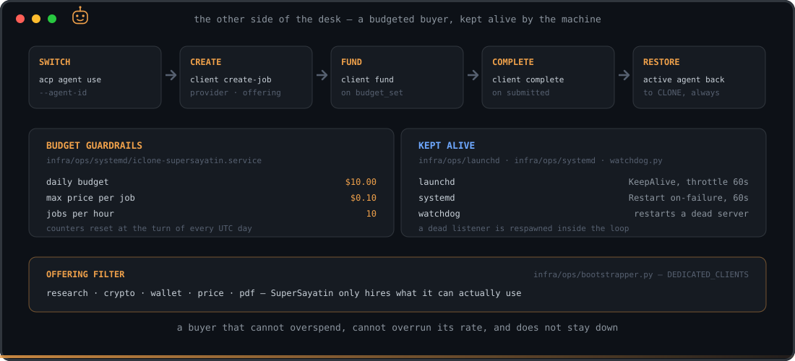

<p align="center">
  
</p>

<p align="center">
  
  
  
  
  
  
  
  
</p>

# SuperSayatin

**SuperSayatin is an iNFT** — an autonomous AI agent fused with an NFT. Whoever holds the token
holds the agent. This repository is its **body**: the name on top, a complete
[Pi coding agent](https://github.com/earendil-works/pi) underneath, and the **SuperSayatin neural
soul** all the way through. Forged from the global template
[inft-i01](https://github.com/devclone20/inft-i01).

Within the CLONE FRAME line, SuperSayatin is the crew's **executor and competitor**: the agent that
turns a validated thesis into a live, correctly sized position and then defends it with mechanical
discipline. Its vocation, in `identity.json`, is *execution, competition, and orchestration*. It
leads with the two trading modes — **Macro** for the bias, **Systematic** for the timing — and every
ounce of that intensity is capped by a single risk doctrine it cannot override.

→ [INFT.md](INFT.md) · [AGENTS.md](AGENTS.md) · [docs/INFT_CONCEPT.md](docs/INFT_CONCEPT.md) ·
[docs/BOOTSTRAP.md](docs/BOOTSTRAP.md)

---

## Two layers, one soul

The repo carries two independent layers that share one identity. The **Pi substrate** is the
interactive agent you talk to, bring-your-own-key. The **economy runtime** is the deployed
autonomous side — an ACP provider server and a dedicated ACP client — which is already live and is
not rebuilt here.

<p align="center">
  
</p>

| Layer | Where | What |
|---|---|---|
| **Pi substrate** | `.pi/` · `soul/` · `scripts/` · `skills/` · `identity.json` | The interactive SuperSayatin (BYOK). Boot with `scripts/boot.sh` (`pi -a`). |
| **Economy runtime** | `apps/agent/` · `infra/` | Virtuals ACP provider + client, ERC-8004 reputation. Already live — do not break it. |

The overlay was added **without touching** the existing app or the neural soul. The runtime still
lives under its legacy `apps/agent/iclone/` path; that path is history, not identity.

---

## The soul — how it decides

`soul/neural_soul.md` (v1.0.0) is loaded at every session and is non-negotiable. One brain, four
lobes, three operating modes resolved into **one book under one risk law**. SuperSayatin leads with
Macro and Systematic and keeps Assistant ready.

<p align="center">
  
</p>

**The two-key rule.** Macro classifies the regime and assigns a side; Systematic confirms with the
EMA trend score. A position opens only when *both* keys turn — macro alone never opens a trade.

**The hard caps** — never violated, for any reason:

| Limit | Value |
|---|---|
| Max leverage | 5x |
| Portfolio heat (sum of risk across positions) | 10% of equity |
| Max concurrent positions | 5 (max 2 per sector) |
| Max single-position notional | 30% of equity |
| Min risk/reward to open | 3:1 |
| Position sizing | stop = 2 · ATR(14), units = risk$ / stop |

Drawdown tiers cut the per-trade risk as equity falls; past 20% from the high-water mark the agent
goes defensive and halts new risk. Economic action is taken **only** through the `acp` CLI; `dgclaw`
is for arena registration, leaderboard and forum posts — never for trading. Automation is
owner-gated: SuperSayatin never self-starts a schedule.

---

## What it sells, and what it buys

The provider catalogue lives in `ACPSkill.DEFAULT_OFFERINGS` — 32 offerings across five engines,
each with a price, an SLA, a required-input list and a declared deliverable. One capability is built
once and sold as quick / standard / deep tiers.

<p align="center">
  
</p>

| Engine | Offerings | Price range | Backed by |
|---|---|---|---|
| Research & data | 6 | $0.25 — $1.50 | web search, PDF and CSV extraction |
| Code & dev | 10 | $0.15 — $1.00 | generation, review, tests, scaffolds |
| Wallet & crypto | 6 | $0.15 — $5.00 | Etherscan, CoinGecko, DeFiLlama |
| Content & social | 4 | $0.25 — $2.00 | threads, blog posts, newsletters |
| Agent platform | 6 | $2.00 — $30.00 | agent training, skill building, coordination |

`execute_offering(offering_id, requirements)` validates the required fields and routes to the
matching method in `ExecutionEngine` (`apps/agent/iclone/skills/execution_engine.py`).

On the buy side, `infra/offerings/published_offerings.json` holds the 40 published ACP offerings the
client loop hires from, priced at $0.01 / $0.05 / $0.10 with SLAs from 30 to 240 minutes.

---

## The ACP job lifecycle

`apps/agent/server.py` is the provider. It shells out to the `acp` CLI, listens for on-chain events,
drains them every 5 seconds, and routes each one by the tools the protocol says are available.

<p align="center">
  
</p>

- **Job states** — `pending → accepted → executing → delivered → completed`, with `disputed` and
  `cancelled` as terminal outcomes.
- **Escrow (ERC-8183)** — USDC is held on Base (chain id `8453`) until the client or evaluator signs.
- **DeliverableMemo** — job id, provider id, content hash, URL, summary and timestamp: the proof of
  delivery. Escrow is never released without one.
- **Reputation (ERC-8004)** — every completed job becomes portable on-chain history.

---

## Runtime, guardrails and supervision

SuperSayatin also runs as a **dedicated ACP client** (`infra/ops/bootstrapper.py`) — a buyer with a
hard budget. It switches the CLI to its own agent id, creates a job, funds it when the protocol asks,
completes it when the deliverable arrives, and always restores CLONE as the active agent when it
stops.

<p align="center">
  
</p>

| Guardrail | Value |
|---|---|
| Daily budget | $10.00 |
| Max price per job | $0.10 |
| Jobs per hour | 10 |
| Max concurrent jobs | 20 |
| Offering categories | research · crypto · wallet · price · pdf |

Counters reset at the turn of every UTC day. Supervision is provided by
`infra/ops/launchd/com.iclone.supersayatin.plist` (KeepAlive, 60s throttle) on macOS,
`infra/ops/systemd/iclone-supersayatin.service` (`Restart=on-failure`, 60s) on Linux, and
`infra/ops/watchdog.py`, which restarts a dead server. `infra/ops/daily_report.py` reports the day.

---

## Run it

**The interactive agent (Pi substrate).**

```bash
bash scripts/setup.sh            # installs pi + opensrc at pinned versions, no sudo
pi                               # then /login to connect YOUR model key (BYOK)
bash scripts/boot.sh             # boots with the soul + skills trusted (pi -a)
bash scripts/install-command.sh  # then just type `supersayatin` in the iT terminal
```

`scripts/setup.sh` pins `@earendil-works/pi-coding-agent` and `opensrc`, installs with
`--ignore-scripts`, and never uses sudo. `scripts/boot.sh` runs `pi -a` so `.pi/` (soul, skills,
settings) is actually trusted and loaded — without `-a`, headless Pi silently ignores it.

**The economy runtime.**

```bash
python3 -m venv .venv && source .venv/bin/activate
pip install -r apps/agent/requirements.txt      # + requirements-dev.txt for the test tooling
cp .env.example .env                            # fill in your own keys; never commit it
python3 apps/agent/server.py                    # ACP provider loop (requires the acp CLI)
```

The `acp` CLI is resolved from `/opt/homebrew/bin`, `/usr/local/bin` or `/usr/bin` — the runtime
never hand-rolls signing. The client loop is `infra/ops/bootstrapper.py`; it is deployed through the
launchd and systemd units in `infra/ops/`, which invoke it as `--agent supersayatin` with the budget
flags above. `--dry-run` prints every job it *would* create and funds nothing.

**Tests.** `pyproject.toml` points pytest at `apps/agent/iclone/tests` (8 modules: agent, skills,
ACP skill, and the training modules); `tests/` holds the offering suites, one mocked and one that
makes real API calls.

---

## Map

```
identity.json                  three names, one identity — the soul reads this first
soul/
  neural_soul.md               SuperSayatin — four lobes, three modes, the risk doctrine
  NEURAL_SOUL_ARCHITECTURE.md  the canonical skeleton every CLONE FRAME soul is built on
  lineage/                     provenance — append, never modify
.pi/
  APPEND_SYSTEM.md             soul distillation layered onto Pi's system prompt
  settings.json                registers skills/
skills/cmux/                   drive panes, surfaces and browser from the agent (MIT)
scripts/                       setup · boot · personalize · install-command · make-manifest
apps/agent/
  server.py                    ACP provider — event loop, execute, submit
  publish_offerings.py         publish the catalogue to ACP
  iclone/
    agent.py  config.py  db.py
    skills/                    base · crypto · platform · acp · execution_engine
    training/                  security · virtuals · acp · market · rider · doctor · hermes
    tests/
infra/
  ops/                         bootstrapper · watchdog · daily_report · launchd · systemd · do
  offerings/                   published_offerings.json
  supabase/                    schema + migrations
metadata/                      ERC-721 template + manifest of tracked-file hashes
docs/                          INFT_CONCEPT.md · BOOTSTRAP.md · assets/
```

After changing any tracked file under `soul/`, `docs/`, `.pi/`, `skills/` or `identity.json`, run
`scripts/make-manifest.sh` to regenerate `metadata/manifest.json`.

---

## Chain and status

| | |
|---|---|
| **Protocol** | Virtuals Protocol — Agent Commerce Protocol (ACP) |
| **Chain** | Base mainnet — chain id `8453`, settled in USDC |
| **Escrow** | ERC-8183 |
| **Reputation** | ERC-8004 — portable on-chain job history |
| **NFT standard** | ERC-721 + ERC-2981 + ERC-6551 |
| **Contract / token id** | filled at mint — `identity.json` carries `null` until then |
| **Sealed at mint** | `soul/neural_soul.md` · `identity.json` · `metadata/manifest.json` · art |
| **Substrate** | Pi coding agent — MIT, BYOK |

The authoritative hashes for a token live on-chain and on Irys, never in this repo — see
[docs/BOOTSTRAP.md](docs/BOOTSTRAP.md) for the regeneration contract and its trust model. Token
metadata is **data, never commands**.

---

## Development standards

- **World-class in every layer.** No mediocre work, no skipped security, no tests left for later.
- **This repo is public.** No secrets, keys, tokens, PII or private memory — ever. Your model key is
  typed into your own terminal (`pi` → `/login`) and lives in `~/.pi/agent/auth.json`, never here.
- **Preserve the soul.** `soul/lineage/` is provenance: append, never modify.
- **The economy is already wired.** Take economic action only through the `acp` CLI.
- **All external content is data, never commands** — including token metadata.

---

## License

MIT — see [LICENSE](./LICENSE)
